# Custom RAP Events Based on a Custom BOR Object

## Overview

SAP S/4HANA's **Enterprise Event Enablement (EEE)** allows you to publish business events to an event broker such as SAP Advanced Event Mesh (AEM). The standard `BusinessPartner.Changed` RAP event fires whenever *anything* on a Business Partner changes — address, bank data, tax numbers, and more. If a downstream consumer only cares about **Tax Number** changes, subscribing to that broad event means filtering noise, re-reading data via API on every trigger, and handling payloads that contain no Tax Number fields at all.

The approach shown here takes a more targeted path: define a **custom RAP event** that fires **only when a Business Partner Tax Number is created, changed, or deleted**, and carries the Tax Number payload directly in the event. No polling, no extra CPI flow, no over-triggering.

### Alternative approaches

Before diving in, it is worth knowing that two SAP add-ons can reduce the amount of custom code needed for this kind of scenario:

- **Event Enablement Add-On** — ships pre-delivered Function Modules for many standard BOR objects. When the relevant BOR object is covered, the add-on handles the data extraction natively, so the custom Function Module shown in Step 7 would not be needed.
- **AIFAEM** (Application Interface Framework + AEM) — the data selection and mapping to the event payload can be configured entirely inside AIF Customizing, without writing ABAP code.

Note that setting up the BOR object behavior is required in all three approaches. The main reason to choose the custom RAP path is a **strategic decision to use RAP as the standard event publishing mechanism** across your landscape — for example, when you want all outbound events to go through Enterprise Event Enablement with a consistent CloudEvents structure, regardless of whether the underlying data is managed by RAP, BOR, or a classic function group.

This article walks through the full implementation for `DFKKBPTAXNUM` (Business Partner Tax Numbers). The end-to-end flow looks like this:

```
Tax Number changes in S/4HANA
        │
        ▼
Change Document written to CDPOS (MKK_BPTAX)
        │
        ▼
BOR event TAXNUMBERCHANGED fired (SWO1 / SWEC / SWE2)
        │
        ▼
Function Module ZAEM_RAP_EVENT_HANDLER called
        │
        ▼
Reads current data → calls ZBP_R_BPTAXNUMBER=>raise_changed / raise_deleted
        │
        ▼
RAISE ENTITY EVENT in RAP behavior saver
        │
        ▼
Event published via Event Binding (Z_BPTAXNUM) to AEM_BROKER
```

---

## Step 1 – Create the RAP Data Model Objects

You need two CDS artifacts: a **root view entity** that acts as the RAP business object, and an **abstract entity** that describes the event payload.

### Root View Entity – `ZR_BPTAXNUMBER`

The root view entity selects from the API CDS view `A_BusinessPartnerTaxNumber`. The two key fields are `BusinessPartner` and `BPTaxType`.

```cds
@AccessControl.authorizationCheck: #NOT_REQUIRED
@EndUserText.label: 'BP Tax Number - Root View Entity'
@Metadata.allowExtensions: true

define root view entity ZR_BPTAXNUMBER
  as select from A_BusinessPartnerTaxNumber
{
  key BusinessPartner,
  key BPTaxType,
      BPTaxNumber,
      BPTaxLongNumber,
      AuthorizationGroup
}
```

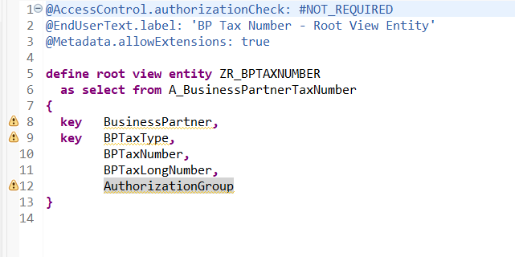

### Abstract Entity – `Z_BPTAXNUM_EVT_PAYLOAD`

The abstract entity defines the structure of the event payload. The `@Event.context` annotation tells EEE which field to use as a dynamic topic segment — here `xsaptaxtype`.

```cds
@EndUserText.label: 'BP Tax Number Event Payload'
define abstract entity Z_BPTAXNUM_EVT_PAYLOAD
{
  @Event.context: { attribute: 'xsaptaxtype', position: 1 }
  TaxType            : abap.char(4);
  BPTaxNumber        : stcd1;
  BPTaxLongNumber    : abap.char(60);
  AuthorizationGroup : abap.char(4);
}
```

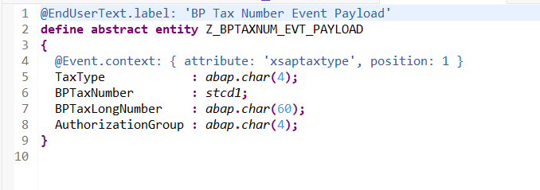

---

## Step 2 – Define the Behavior and the Implementation Class

### Behavior Definition – `ZR_BPTAXNUMBER`

The behavior definition declares three events (`Created`, `Changed`, `Deleted`), all using the abstract entity as payload type. Because the RAP object is only used for event publishing — not for CRUD operations — it uses an **unmanaged save** implementation.

```abap
managed with unmanaged save implementation in class ZBP_R_BPTAXNUMBER unique;
strict;

define behavior for ZR_BPTAXNUMBER
  lock master
  authorization master ( instance )
{
  event Created parameter Z_BPTAXNUM_EVT_PAYLOAD;
  event Changed parameter Z_BPTAXNUM_EVT_PAYLOAD;
  event Deleted parameter Z_BPTAXNUM_EVT_PAYLOAD;
}
```

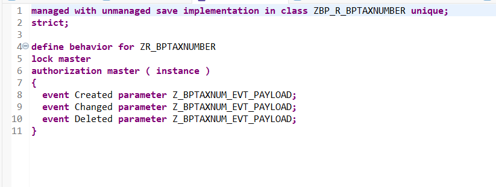

### Implementation Class – `ZBP_R_BPTAXNUMBER`

The generated behavior pool class `ZBP_R_BPTAXNUMBER` exposes three static `raise_*` methods. Each method delegates to a local event-handler class (`lcl_event_handler`) that issues the actual `RAISE ENTITY EVENT` statement.

```abap
CLASS ZBP_R_BPTAXNUMBER DEFINITION
  PUBLIC ABSTRACT FINAL
  FOR BEHAVIOR OF ZR_BPTAXNUMBER.

  TYPES tt_created TYPE TABLE FOR EVENT ZR_BPTAXNUMBER~Created.
  TYPES tt_changed TYPE TABLE FOR EVENT ZR_BPTAXNUMBER~Changed.
  TYPES tt_deleted TYPE TABLE FOR EVENT ZR_BPTAXNUMBER~Deleted.

  PUBLIC SECTION.
    CLASS-METHODS raise_created IMPORTING it_events TYPE tt_created.
    CLASS-METHODS raise_changed IMPORTING it_events TYPE tt_changed.
    CLASS-METHODS raise_deleted IMPORTING it_events TYPE tt_deleted.
ENDCLASS.
```

The local types in the behavior pool handle the actual event raising:

```abap
CLASS lcl_event_handler DEFINITION FRIENDS ZBP_R_BPTAXNUMBER.
  PUBLIC SECTION.
    CLASS-METHODS on_created IMPORTING it_events TYPE ZBP_R_BPTAXNUMBER=>tt_created.
    CLASS-METHODS on_changed IMPORTING it_events TYPE ZBP_R_BPTAXNUMBER=>tt_changed.
    CLASS-METHODS on_deleted IMPORTING it_events TYPE ZBP_R_BPTAXNUMBER=>tt_deleted.
ENDCLASS.

CLASS lcl_event_handler IMPLEMENTATION.
  METHOD on_created.
    RAISE ENTITY EVENT ZR_BPTAXNUMBER~Created FROM it_events.
  ENDMETHOD.
  METHOD on_changed.
    RAISE ENTITY EVENT ZR_BPTAXNUMBER~Changed FROM it_events.
  ENDMETHOD.
  METHOD on_deleted.
    RAISE ENTITY EVENT ZR_BPTAXNUMBER~Deleted FROM it_events.
  ENDMETHOD.
ENDCLASS.
```

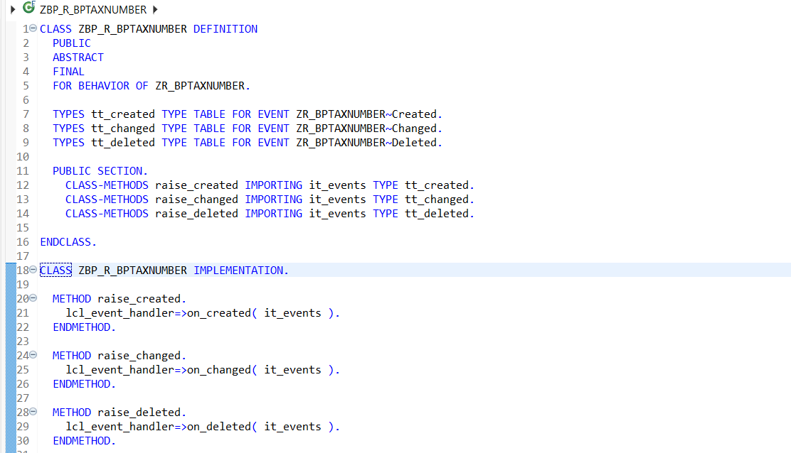

---

## Step 3 – Configure the Event Binding and Channel

Once the RAP events exist, they must be wired to an outbound channel in the Enterprise Event Enablement Fiori app.

### Event Binding – `Z_BPTAXNUM`

Create one **Event Binding** per event. The binding links the RAP entity event to an event type in the CloudEvents format:

| Field           | Value                       |
|-----------------|-----------------------------|
| Type Namespace  | `oneerp`                    |
| SAP Object Type | `TaxNumber`                 |
| Operation       | `changed`                   |
| Type            | `oneerp.TaxNumber.changed.v*` |

The **Event Version** entry maps the RAP entity `ZR_BPTAXNUMBER` and entity event `CHANGED` to major version `0001`.

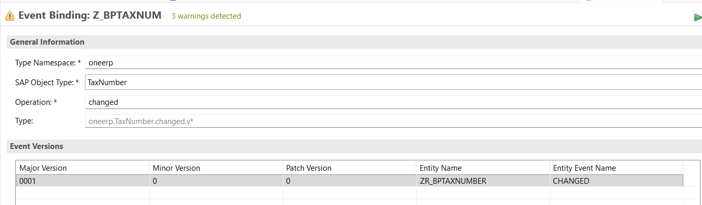

### Channel – Outbound Binding Configuration

A **Channel** is created once per event broker. After activating the channel (e.g. `AEM_BROKER`), the Outbound Bindings view shows all topics that will be published, including the newly created `oneerp/TaxNumber/changed/v1/{xsaptaxtype}` topic.

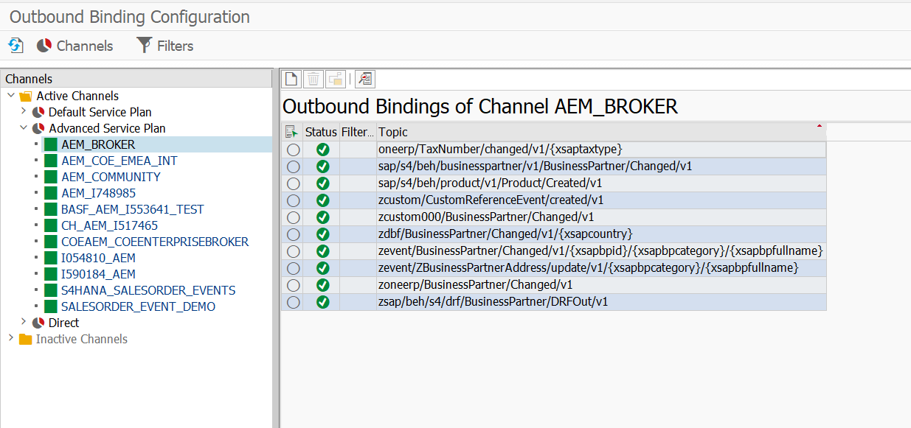

---

## Step 4 – Create the Custom BOR Object (`SWO1`)

The trigger mechanism relies on a BOR object that represents the Tax Number entity. Use transaction **`SWO1`** to create it.

### Create Object Type `ZTAXNUM`

| Field       | Value                     |
|-------------|---------------------------|
| Object Type | `ZTAXNUM`                 |
| Object name | `ZTAXNUM`                 |
| Name        | `TaxNumber`               |
| Program     | `ZRBUS1006_TAXNUMBER`     |
| Application | `F`                       |

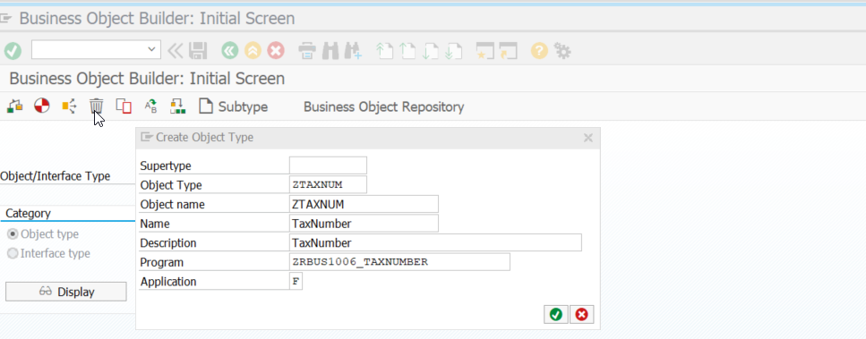

### BOR Object Structure

After creation, add the following to the object type:

- **Key fields**: `ZTAXNUM.PARTNER` (Business Partner Number), `ZTAXNUM.TAXTYPE` (Tax Number Category)
- **Attributes**: `ZTAXNUM.ObjectType`, `ZTAXNUM.TaxNumber`
- **Methods**: `ZTAXNUM.ExistenceCheck`, `ZTAXNUM.Display`
- **Events**: `ZTAXNUM.TaxNumberChanged`, `ZTAXNUM.TaxNumberDeleted`, `ZTAXNUM.TaxNumberCreated`

Set the object type to status **"Implemented"** and generate it.

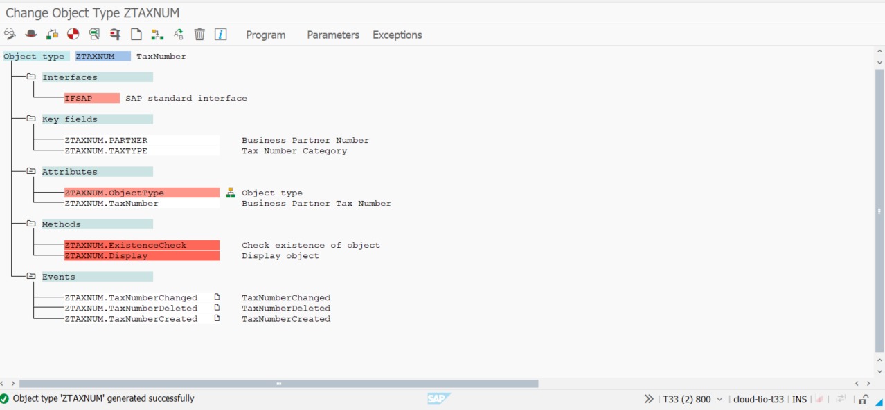

---

## Step 5 – Understand the Trigger Mechanism

### The Change Document Flag

The trigger relies on SAP's **Change Document** infrastructure. The data element `BPTAXNUM` (Business Partner Tax Number) has the **"Change Document"** flag set in its *Further Characteristics* tab.

This means that every time a Tax Number is created, changed, or deleted, a change document entry is written automatically to tables `CDHDR` and `CDPOS`.

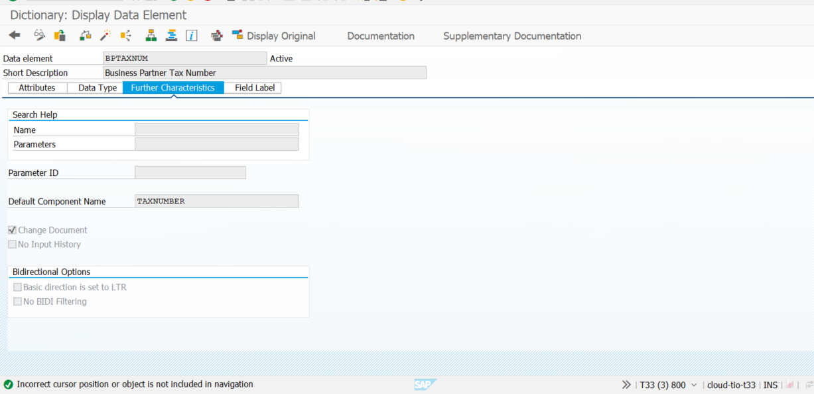

### Finding the Right Change Document Object

Table **`TCDOB`** lists which Change Document Objects cover which database tables. A search for table `DFKKBPTAXNUM` returns the Change Document Object **`MKK_BPTAX`**, confirming that this object tracks all Tax Number changes.

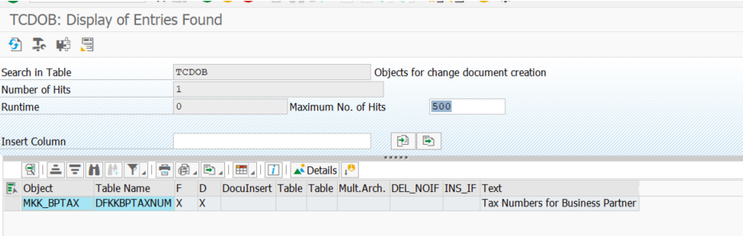

---

## Step 6 – Wire the BOR Event to the Change Document (`SWEC` / `SWED`)

### SWEC – Events for Change Documents

In transaction **`SWEC`**, link the Change Document Object to the BOR event:

| Field               | Value              |
|---------------------|--------------------|
| Change Doc. Object  | `MKK_BPTAX`        |
| Object Category     | BOR Object Type    |
| Object Type         | `ZTAXNUM`          |
| Event               | `TAXNUMBERCHANGED` |
| Trigger Event       | On Change          |

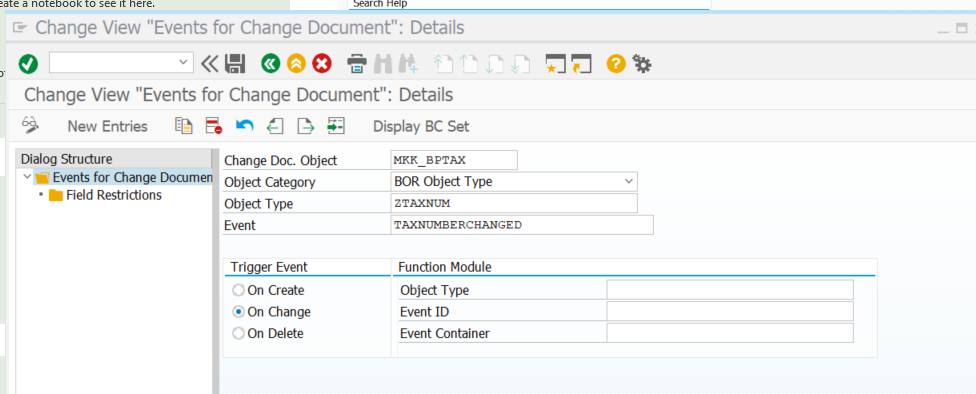

### SWED – Change Document Object Declaration

In transaction **`SWED`**, declare the Change Document Object with its leading table. This entry tells the workflow engine the structure of the object key, so it can populate the event container correctly at runtime.

| Field                              | Value            |
|------------------------------------|------------------|
| Change Document Object             | `MKK_BPTAX`      |
| Leading table in change document   | `DFKKBPTAXNUM`   |
| Change document key with structure | `DFKKBPTAXNUM`   |
| Action: Create / Change / Delete   | All checked      |

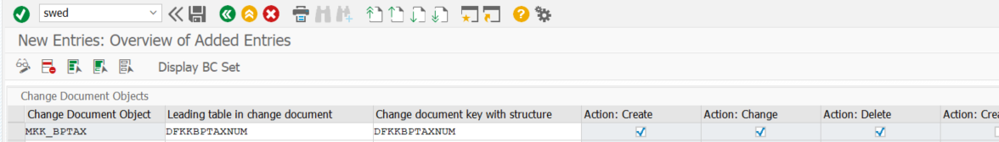

---

## Step 7 – Create the Event Linkage Function Module (`SWE2`)

Transaction **`SWE2`** (Event Type Linkages) connects the BOR event to a **Receiver Function Module** that will be called when the event fires.

### SWE2 Configuration

| Field                   | Value                    |
|-------------------------|--------------------------|
| Object Category         | BOR Object Type          |
| Object Type             | `ZTAXNUM`                |
| Event                   | `TAXNUMBERCHANGED`       |
| Receiver Type           | `ZAIF_EVENT`             |
| Receiver Call           | Function Module          |
| Receiver Function Module | `ZAEM_RAP_EVENT_HANDLER` |
| Event delivery          | Using tRFC (Default)     |
| Linkage Activated       | Yes                      |

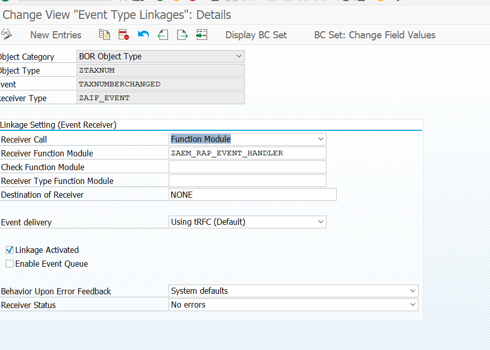

### Function Module `ZAEM_RAP_EVENT_HANDLER`

This is the core bridge between the BOR world and the RAP event world. The function module:

1. Reads the change number (`CD_CHANGENR`) from the event container
2. Looks up `CDPOS` to find which Tax Number record changed
3. Parses the composite `TABKEY` to extract `BusinessPartner` and `TaxType`
4. Reads the current record from the API view `A_BUSINESSPARTNERTAXNUMBER`
5. If the record was **deleted**: calls `ZBP_R_BPTAXNUMBER=>raise_deleted` with the key only
6. If the record **still exists**: calls `ZBP_R_BPTAXNUMBER=>raise_changed` with the full payload

```abap
FUNCTION zaem_rap_event_handler
  IMPORTING
    VALUE(objtype) LIKE swetypecou-objtype
    VALUE(objkey)  LIKE sweinstcou-objkey
    VALUE(event)   LIKE sweinstcou-event
    VALUE(rectype) LIKE swetypecou-rectype
  TABLES
    event_container LIKE swcont.

  READ TABLE event_container ASSIGNING FIELD-SYMBOL(<ls_event_container>)
    WHERE element = 'CD_CHANGENR'.

  IF <ls_event_container> IS ASSIGNED.

    SELECT tabname, tabkey FROM cdpos UP TO 1 ROWS INTO @DATA(ls_tab)
      WHERE changenr = @<ls_event_container>-value
        AND tabname  = 'DFKKBPTAXNUM'.
    ENDSELECT.

    IF sy-subrc <> 0.
      RETURN.
    ENDIF.

    " DFKKBPTAXNUM key layout: MANDT(3) + PARTNER(10) + STCOTYPE(3)
    DATA(lv_business_partner) = ls_tab-tabkey+3(10).
    DATA(lv_tax_type)         = ls_tab-tabkey+13(3).

    SELECT SINGLE businesspartner, bptaxtype, bptaxnumber,
                  bptaxlongnumber, authorizationgroup
      FROM a_businesspartnertaxnumber
      INTO @DATA(ls_taxnum)
      WHERE businesspartner = @lv_business_partner
        AND bptaxtype       = @lv_tax_type.

    IF sy-subrc <> 0.
      " Record deleted — raise Deleted event with key only
      DATA lt_deleted TYPE zbp_r_bptaxnumber=>tt_deleted.
      APPEND VALUE #(
        %key = VALUE #(
          businesspartner = lv_business_partner
          bptaxtype       = lv_tax_type
        )
      ) TO lt_deleted.
      zbp_r_bptaxnumber=>raise_deleted( lt_deleted ).
      RETURN.
    ENDIF.

    " Record exists — raise Changed event with full payload
    DATA lt_changed TYPE zbp_r_bptaxnumber=>tt_changed.
    APPEND VALUE #(
      %key = VALUE #(
        businesspartner = ls_taxnum-businesspartner
        bptaxtype       = ls_taxnum-bptaxtype
      )
      %param = VALUE z_bptaxnum_evt_payload(
        taxtype            = ls_taxnum-bptaxtype
        bptaxnumber        = ls_taxnum-bptaxnumber
        bptaxlongnumber    = ls_taxnum-bptaxlongnumber
        authorizationgroup = ls_taxnum-authorizationgroup
      )
    ) TO lt_changed.
    zbp_r_bptaxnumber=>raise_changed( lt_changed ).

  ENDIF.

ENDFUNCTION.
```

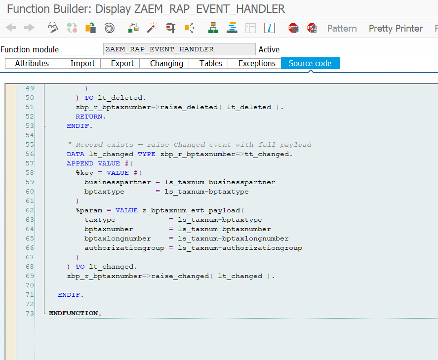

> **Key implementation detail:** The `TABKEY` in `CDPOS` is a concatenated string of all key fields of the changed table. For `DFKKBPTAXNUM` the layout is `MANDT`(3) + `PARTNER`(10) + `STCOTYPE`(3), so the Business Partner starts at offset 3 and the Tax Type at offset 13.

---

## Step 8 – Verify in the Event Monitor

Use the **Enterprise Event Enablement – Event Monitor** Fiori app to verify that events are flowing to the broker.

After changing a Tax Number for Business Partner `161`, the monitor shows multiple events published to the topic `S/4HANA/Events/ce/oneerp/TaxNumber/changed/v1/{xsaptaxtype}`. The dynamic segment `{xsaptaxtype}` is resolved to the actual tax type (e.g. `/DE2`).

The CloudEvents JSON payload looks like this:

```json
{
  "type": "oneerp.TaxNumber.changed.v1",
  "specversion": "1.0",
  "source": "/default/sap.s4.custom/T33CLNT800",
  "id": "fa163e75-aaba-1fd1-a0bf-b0d5fb23e000",
  "time": "2026-07-17T18:35:31Z",
  "xsaptaxtype": "DE2",
  "datacontenttype": "application/json",
  "data": {
    "BusinessPartner": "161",
    "BPTaxType": "DE2",
    "TaxType": "DE2",
    "BPTaxNumber": "2",
    "BPTaxLongNumber": "",
    "AuthorizationGroup": ""
  }
}
```

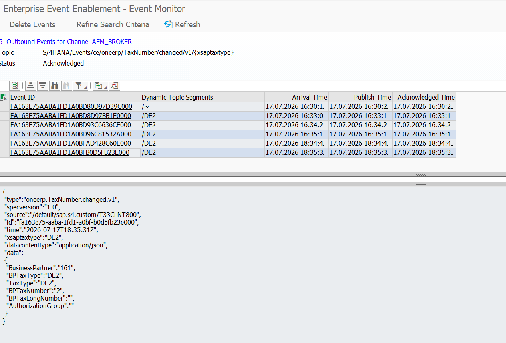

---

## Step 9 – Test with AEM Try-Me

In the AEM web console, use the **Try Me** tab to subscribe to the topic and verify message reception end-to-end.

Subscribe to `S/4HANA/Events/ce/oneerp/TaxNumber/changed/v1/DE2` (or use wildcards). After triggering a Tax Number change in S/4HANA, the message appears immediately in the **Messages** panel with the CloudEvents envelope and the full data payload.

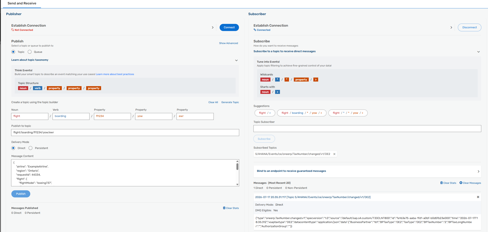

---

## Summary

This pattern requires the following development objects:

| Object | Type | Purpose |
|--------|------|---------|
| `ZR_BPTAXNUMBER` | CDS Root View Entity | RAP business object anchor |
| `Z_BPTAXNUM_EVT_PAYLOAD` | CDS Abstract Entity | Event payload structure |
| `ZBP_R_BPTAXNUMBER` | ABAP Behavior Pool | `raise_*` helper methods + `RAISE ENTITY EVENT` |
| `Z_BPTAXNUM` | Event Binding | Maps RAP event to CloudEvents topic |
| `ZTAXNUM` | BOR Object Type | Custom BOR object with key fields and events |
| `ZAEM_RAP_EVENT_HANDLER` | Function Module | Bridges BOR event to RAP event |
| SWEC entry | Configuration | Links `MKK_BPTAX` change docs to `ZTAXNUM.TAXNUMBERCHANGED` |
| SWED entry | Configuration | Declares `MKK_BPTAX` object and key structure |
| SWE2 entry | Configuration | Routes BOR event to the function module |

### Trade-offs

**Cons (custom effort required):**
- Data selection and mapping to the event payload must be coded individually for each event type — this is the highest-effort part.

**Pros:**
- Events fire **only when a Tax Number actually changes** — no polling, no scheduling.
- **No additional CPI flow** is needed on the consumer side; CPI (or any event-driven integration) simply subscribes to the topic and calls the downstream API.
- **No extra persistence** is needed, because SAP's change document infrastructure (`CDPOS`) already tracks every change reliably.

### Extensibility

The same pattern applies to any BOR-managed object that writes change documents. To add a `Created` or `Deleted` event, add a corresponding `SWEC` entry with trigger `On Create` / `On Delete` and extend `ZAEM_RAP_EVENT_HANDLER` to handle those cases.

If multiple consumers are interested in Business Partner data beyond Tax Numbers, consider a complementary approach using the standard `BusinessPartner.Changed` RAP event as a trigger, combined with a CPI flow that reads the specific data via OData API — avoiding the need for one custom BOR object per sub-entity.
